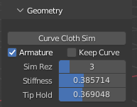
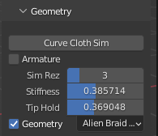
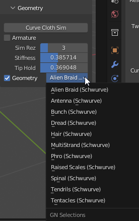
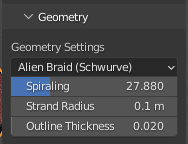
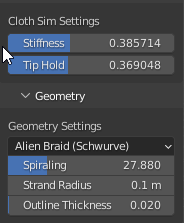
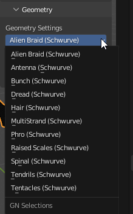

Geometry
========

   

This is the marquee feature of the Schuwrve add-on allowing you to specify various options to convert a Curve Object into a fully functioning set-up containing
an integrated system that is bound to a generated Mesh cloth simulation with hooked-Empties. 

Pre-Generation Settings
-----------------------

Curve Cloth Sim Button
^^^^^^^^^^^^^^^^^^^^^^

This is the button that applies the settings set forth below to create your Schwurve set-ups.  You will likely want to adjust the settings to your preferences
based on your desired use of the set-ups.

Armature Checkbox
^^^^^^^^^^^^^^^^^

This option tells the add-on that you your set-up to consist of an Armature bound to a Mesh with a Cloth simulation modifier applied.  The cloth simulation
controls the armatures movements.  This allows you to have an Armature with physics as the parent of another mesh.  Moreover, if this option is selected you
will also have the option to keep the original curve, but eliminates the `Geometry Checkbox`_ option.  See `Keep Curve`_ and `Geometry Checkbox`_ options below.

.. _Keep Curve:

Keep Curve Option
^^^^^^^^^^^^^^^^^

This option keeps the original curve that generates the physics-based Armature set-up but is not a necessary part of the set-up and is not interacting with
the set-up.

Sim Rez Slider
^^^^^^^^^^^^^^

This dictates the resolution of the simulation ((the number of vertices/control points in original curve - 1) * the Sim Rez value).  For instance, if you set the
Sim Rez to 3 and the curve has three (3) control points, the simulation will contain six (6) segments (e.g., six armature bones).  This value can be set from 1 
to 12, and can only be set prior to applying the set-up.

.. _Stiffness:

Stiffness
^^^^^^^^^

This sets the initial weighting of the cloth simulation where higher values result in a stiffer simulation and lower values result in a limper simulation.  Note 
that the values are very sensitive on the low end and can change the simulation more dramatically than higher end values.  This value can be modified after the
"Curve Cloth Sim" Button is applied in the "Cloth Sim Settings".

.. _Tip Hold:

Tip Hold
^^^^^^^^

This set the initial weighting of the cloth simulation on the "tip" end of the simulation so that this end can be more or less consistent with the rest of the
simulation.  This value can be modified after the "Curve Cloth Sim" Button is applied in the "Cloth Sim Settings".

.. _Geometry Checkbox:

Geometry Checkbox
^^^^^^^^^^^^^^^^^

This option tells the add-on that you want your set-up to include Curve-based Geometry Nodes systems, and allows you to select specific Schwurve Geometry Nodes 
as described in the `Schwurve Nodes Dropdown`_ section below.

.. _Schwurve Nodes Dropdown:

Schwurve Nodes Dropdown
^^^^^^^^^^^^^^^^^^^^^^^

Schwurve comes pre-loaded with several Geometry Nodes set-ups specifically designed to work with the plugin, which are automatically filtered by Schwurve through
the use of the "(Schwurve)" string in the Nodetree name.  You can create your own by utilizing the same string in a new Nodetree that Schwurve will recognize.
When you select your desired Schwurve Nodetree it will apply that set-up to your Curve object (multiple separated curves in the same Curve object will be 
converted to separate systems organized by collections with the same Schwurve Nodetree applied to each one but separately modifiable once created).

Post-Generation Settings
------------------------

.. _Geometry Settings:

Geometry Settings
^^^^^^^^^^^^^^^^^

These settings are specific to the Schwurve Geometry Nodetrees allowing you to modify inputs of those Nodetrees in realtime and change the desired Schwurve set-up.  

.. _Schwurve Nodes Inputs:

.. _Cloth Sim Settings:

Cloth Sim Settings
^^^^^^^^^^^^^^^^^^

You can also modify the Cloth Sim Settings in realtime above the Geometry Settings once you have generated the Schwurve Set Up.  See `Stiffness`_ and `Tip Hold`_ sections for more information about the Stiffness and Tip Hold controls.

Schwurve Nodes Dropdown
^^^^^^^^^^^^^^^^^^^^^^^

As stated above, this dropdown menu will contain all of your Schwurve Geometry Nodetrees that you can apply to the selected Curve.

Schwurve Nodes Inputs
^^^^^^^^^^^^^^^^^^^^^

These settings will vary based on the applied Schwurve Nodetree, but will only display inputs with Float and Integer values in this version.  

.. note:: 
   The values will reset to default and will not be maintained if you switch the selected Schwurve Nodetree.  See "Setting Up Schwurve Nodes" for creating your own Schwurve Nodes.
