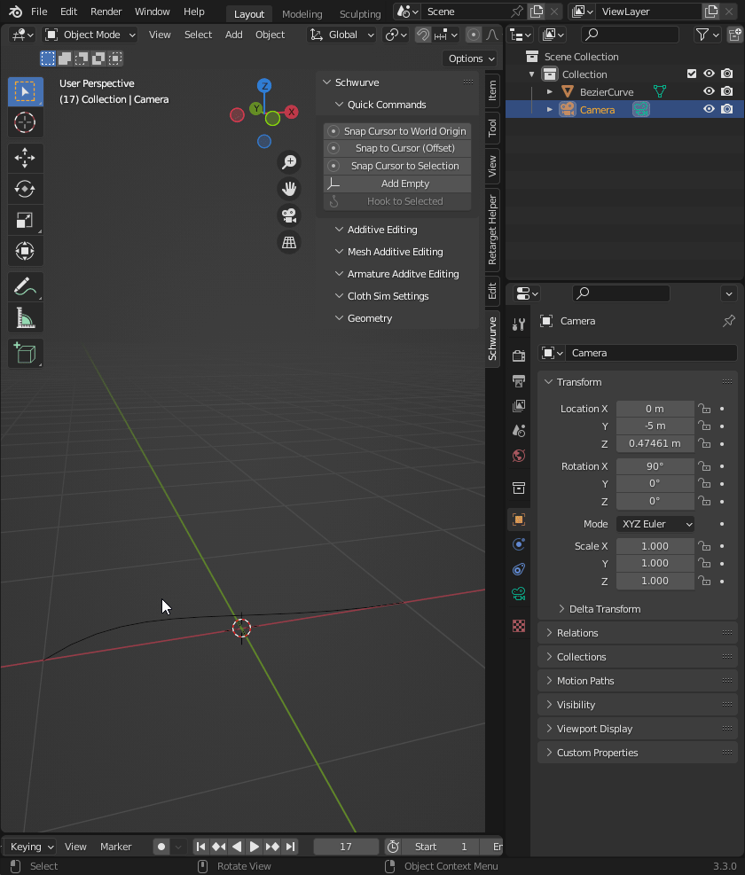

Mesh Additive Editing
---------------------

Mesh Additive Editing is active when you have a selected Mesh Object.  It can be used to apply physics, armatures and setups from the Mesh Object.

.. note::

   In order to work properly it is best to have Mesh Objects without faces and branches from vertices.

**Mesh to Armature** - Button used to create an Armature from a Mesh object with two additional options.

**Rigged Skin** - when this option is checked the Skin Modifier is added to the Mesh Object and is parented to the Armature that is generated.

**Cloth Sim** - when this option is checked the Cloth Sim Modifier is added to the Mesh Object.

**Cloth Empty Vertex Parents** - 

**Cloth Mesh Arm Bind** - Button used to create a setup where the Mesh Object has a Cloth Sim Modifier added, an Armature in the shape of the the Mesh Object, Empties that have been parented to the Mesh Object and control the location of the Armature Bones.  This also allows you to adjust the **Cloth Sim Settings** in realtime once the setup has been generated.

