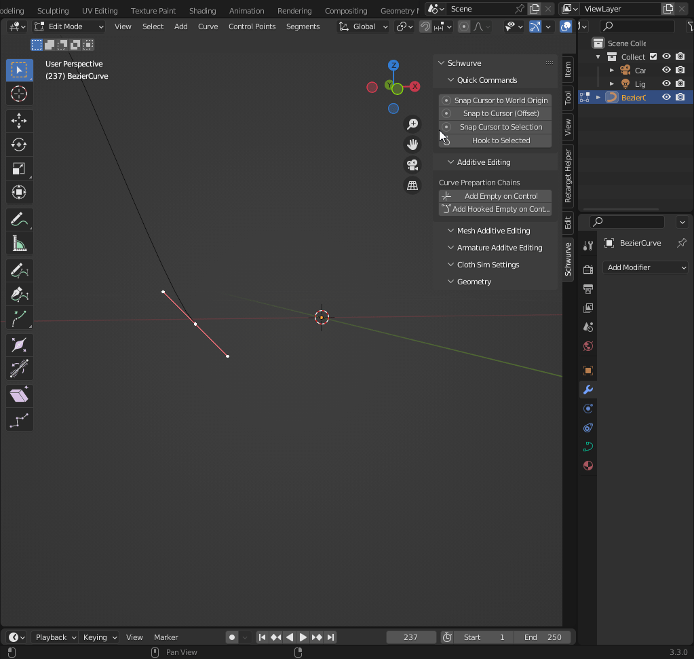
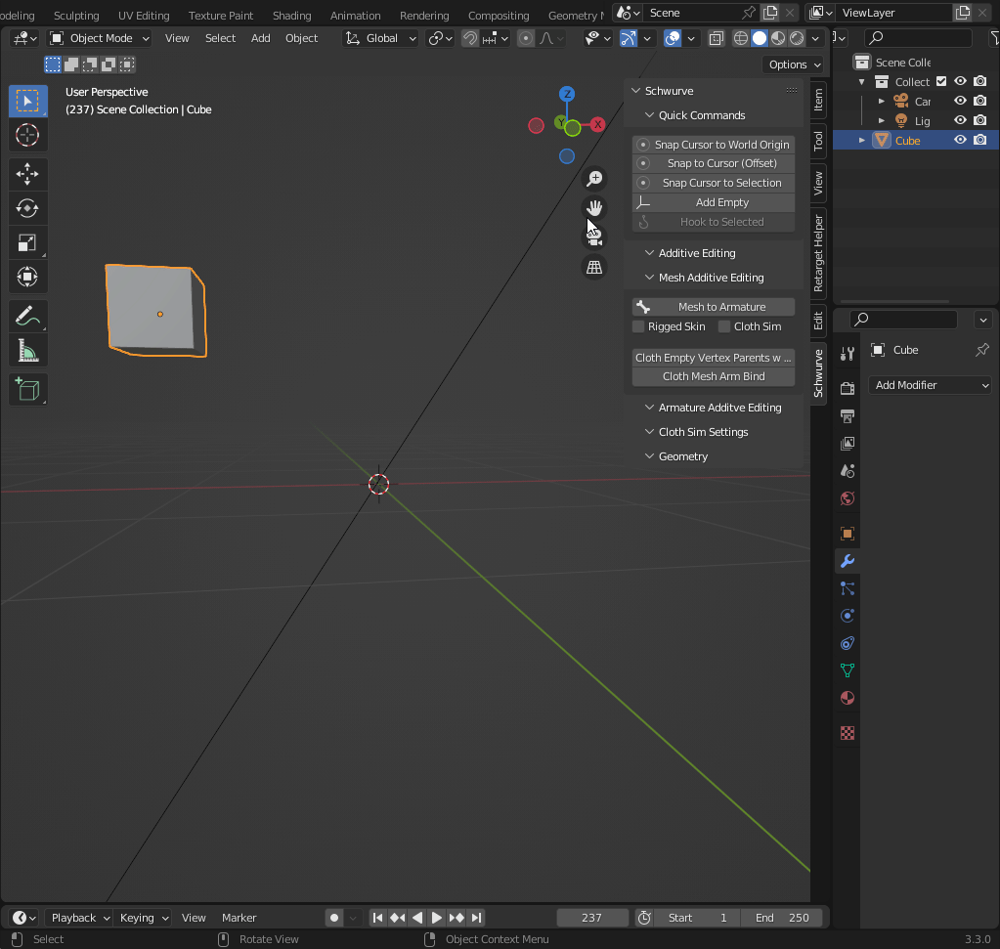
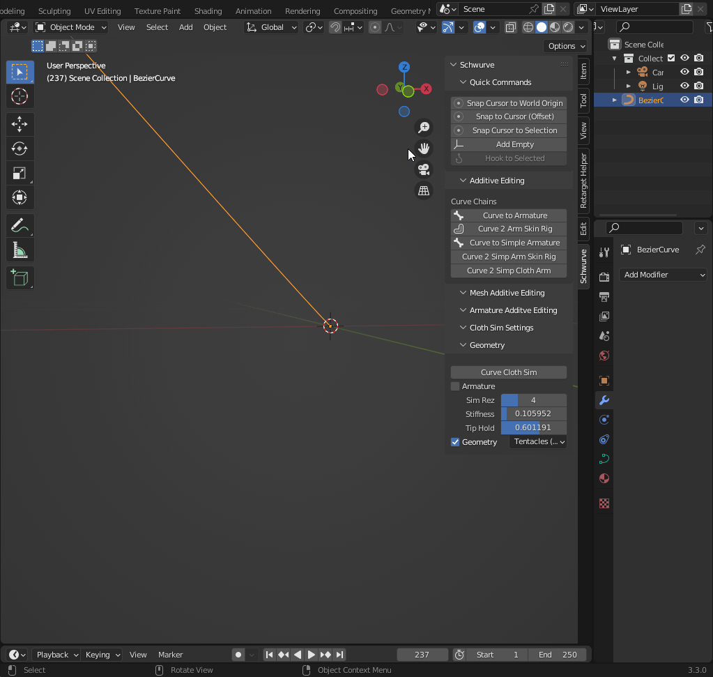
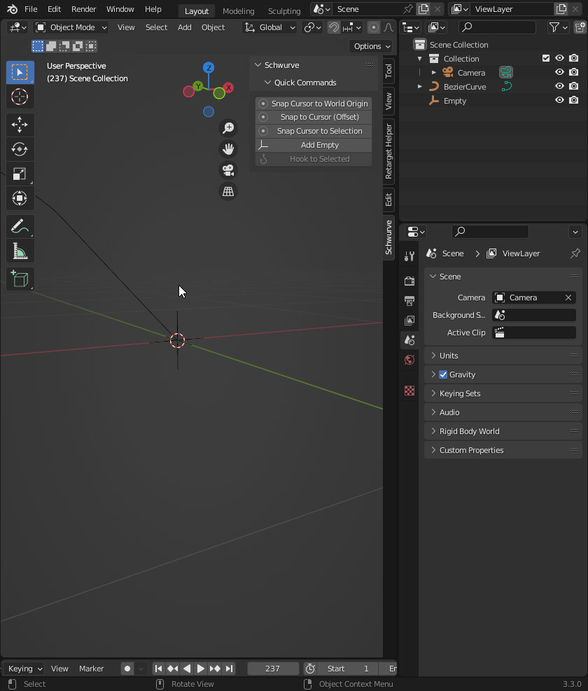

Quick Commands
--------------

Universal Commands
==================

Snap Cursor to World Origin
^^^^^^^^^^^^^^^^^^^^^^^^^^^

Same as menu command to reset Cursor to World origin of 0,0,0

.. image:: ../_static/SnapCursortoWorld.gif

Snap to Cursor(Offset) 
^^^^^^^^^^^^^^^^^^^^^^

Same as menu command but useful for Curve object Control Points and Handles
being moved without collapsing the handles and control points all in the same location.

Snap Cursor to Selection 
^^^^^^^^^^^^^^^^^^^^^^^^

Same as menu command to snap cursor to origin of active object

Object Mode Commands
====================

Add Empty 
^^^^^^^^^

Adds an empty at cursor position

.. _addempty:

Edit Mode Commands
==================

Hook to Selected 
^^^^^^^^^^^^^^^^

Only available if Empty and Mesh or Curve (as active object) are both selected.  
This command will create a hook modifier on the object, using the selected empty associated with the 
selected vertices/control points.  You can use the `addempty`_.

.. admonition:: Directions to Use Hook Selected

   #. In Object Mode

      #. Select Empty

      #. Shift+Select Mesh or Curve Object

   #. In Edit Mode

      #. Select Vertex or Vertices (Control Point(s)) to define Hook Position.  NOTE: If multiple vertices or control points are selected it will be the location in the center of the selected vertices/points.
   
      #. Click on "Hook to Selected" button.

   #. In Object Mode
   
      #. Choose the Empty.
   
      #. Hit G to move the selection in the Viewport to verify that empty moves vertex/vertices on Curve or Mesh.
